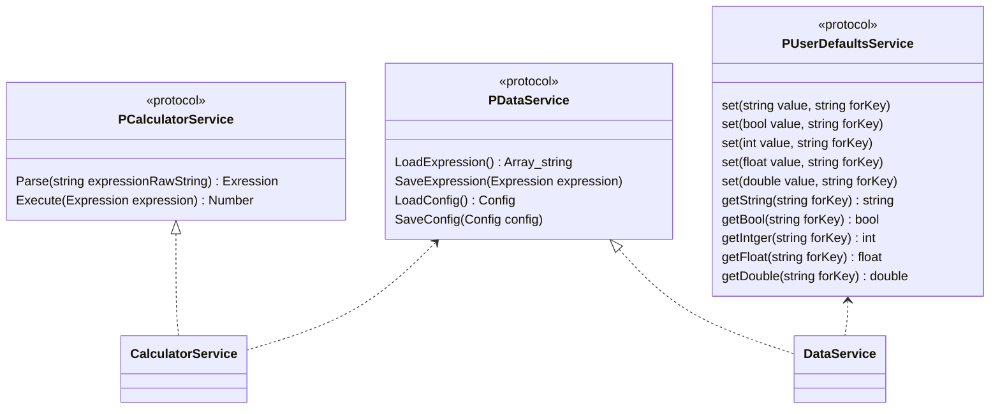
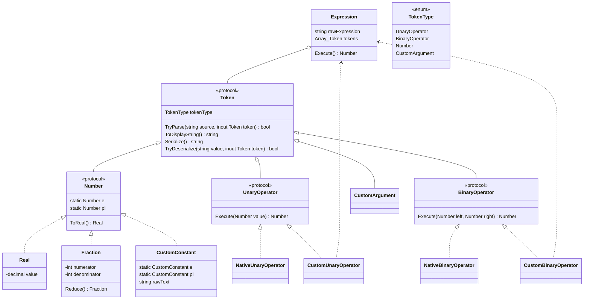

大文字関数名はミスなので書くときに修正してください
UI層とやり取りするところ


Entity系 ロジックはない

`Number`がデカくなりすぎたので移動
```mermaid
classDiagram

class Number {
    <<protocol>>
    IsInteger bool
    ToReal() Real

    // 逆ポーランド記法で処理する都合上演算子の右側が先に
    // 見えてくるので、受け取るのは演算子の左として処理する
    Add(Number left) Number
    Substrct(Number left) Number
    Multiply(Number left) Number
    Divide(Number left) Number
    Modulus(Number left) Number
    Pow(Number left) Number

    Negate() Number
    Abs() Number
    Sqrt() Number
    Sin() Number
    Cos() Number
    Tan() Number
    ArcSin() Number
    ArcCos() Number
    ArcTan() Number
    Log() Number
    Ln() Number
}
