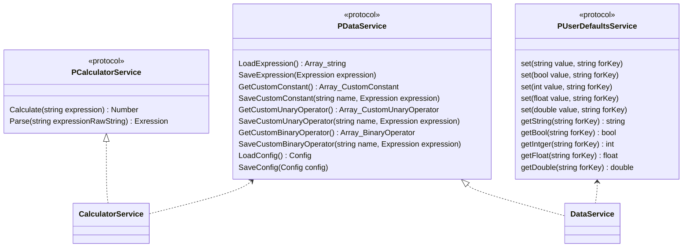
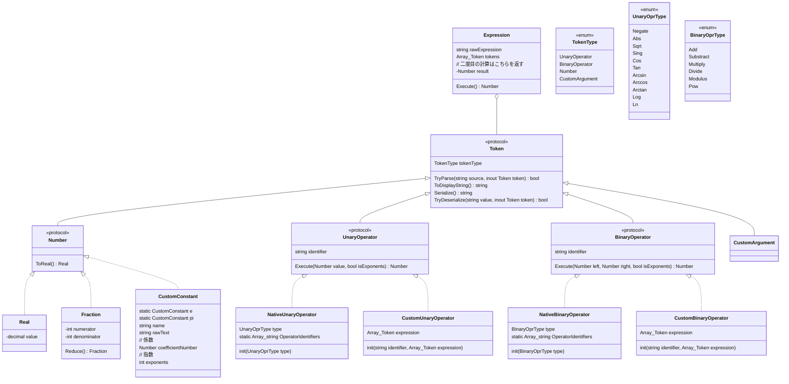

大文字関数名はミスなので書くときに修正してください
UI層とやり取りするところ


Entity系 ロジックはない

`Number`がデカくなりすぎたので移動
```mermaid
classDiagram

class Number {
    <<protocol>>
    IsInteger bool
    ToReal() Real

    // 逆ポーランド記法で処理する都合上演算子の右側が先に
    // 見えてくるので、受け取るのは演算子の左として処理する
    Add(Number left, bool isExponents) Number
    Substract(Number left, bool isExponents) Number
    Multiply(Number left, bool isExponents) Number
    Divide(Number left, bool isExponents) Number
    Modulus(Number left, bool isExponents) Number
    Pow(Number left, bool isExponents) Number

    Negate(bool isExponents) Number
    Abs(bool isExponents) Number
    Sqrt(bool isExponents) Number
    Sin(bool isExponents) Number
    Cos(bool isExponents) Number
    Tan(bool isExponents) Number
    Arcsin(bool isExponents) Number
    Arccos(bool isExponents) Number
    Arctan(bool isExponents) Number
    Log(bool isExponents) Number
    Ln(bool isExponents) Number
}
